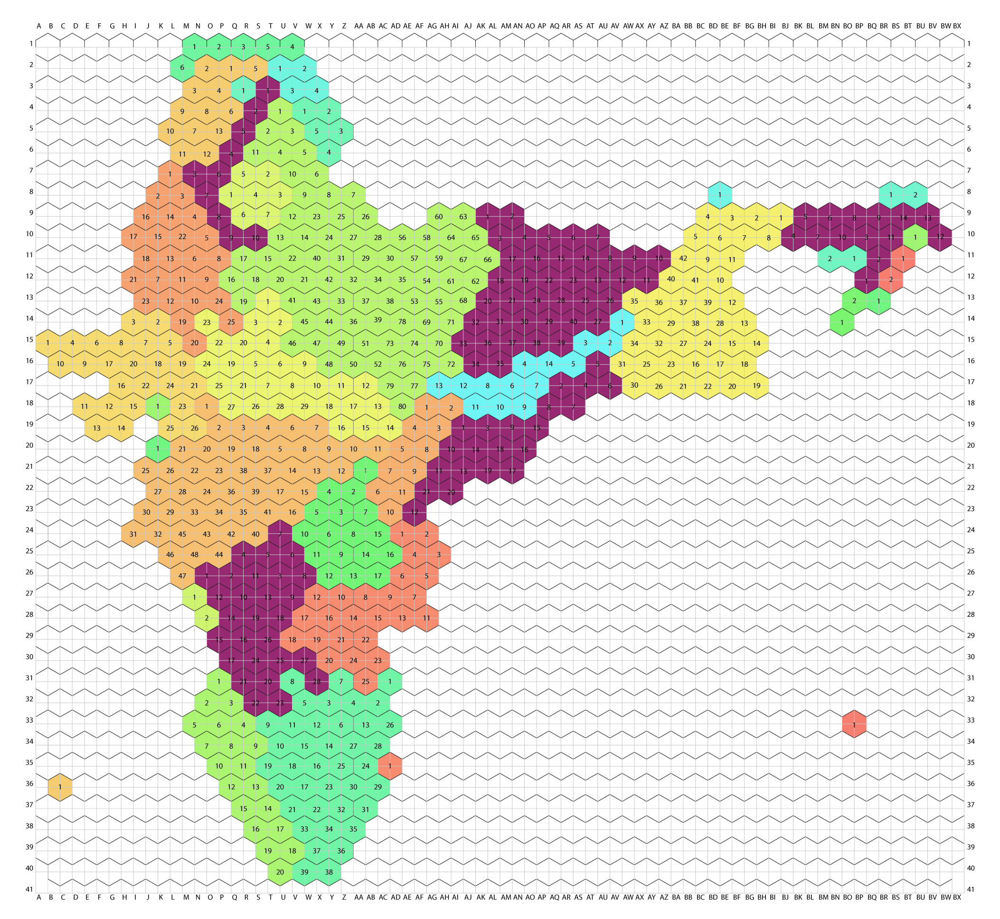

# India-Constituencies-TiIegram

A “tilegram” is a map made of tiles where regions are sized proportionally to a dataset. More details can be found [here](https://github.com/PitchInteractiveInc/tilegrams/blob/master/MANUAL.md)

This project containes the datasheet for creating a tilegram of India where each tile represent one Lok Sabha contituency of India.

## Base Tilegram Map

The base tilegram was take from [https://pitchinteractiveinc.github.io/tilegrams/](https://pitchinteractiveinc.github.io/tilegrams/)

This map was used to generate a excel sheet as grid with each cell as the state code and name of the constituentcy / consticuency no.

## DataFiles

There are datafiles in 2 format:
* CSV
* JSON

__CSV__

There are 2 json file:
* [tiles-data-contituency-name.csv](./Data/tiles-data-contituency-name.csv)
* [tiles-data-contituency-no.csv](./Data/tiles-data-contituency-no.csv)

The only difference between two files is that tiles-data-contituency-name.csv has the contituency names with the states and tiles-data-contituency-no.csv has contituency no. with the state.

CSV files shows the location of the constituencies in the grid as __[x,y]__ position. The location of the center of the hexagon for a constituencies located at x,y position _(here x is column no. and y is row no.)_ in csv file is __[x*radius,y*radius]__ here radius is the size of the hexagon.

__JSON__

There are 2 json file:
* [tiles-data-all-together.json](./Data/tiles-data-all-together.json)
* [tiles-data-state-wise.json](./Data/tiles-data-state-wise.json)

The only difference in both the files is the hierarchy of objects.

A single data object for contituency looks like

    "Name": "Kokrajhar",
    "Reserved": "ST",
    "State": "AS",
    "Constituency No": "5",
    "Coordinate": [
      62,
      8
    ],
    "stateCode": "S03",
    "stateFullName": "Assam"
    
The location of the center of the hexagon is __[Coordinate[0]*radius,Coordinate[1]*radius]__ here radius is the size of the hexagon.

## Example

